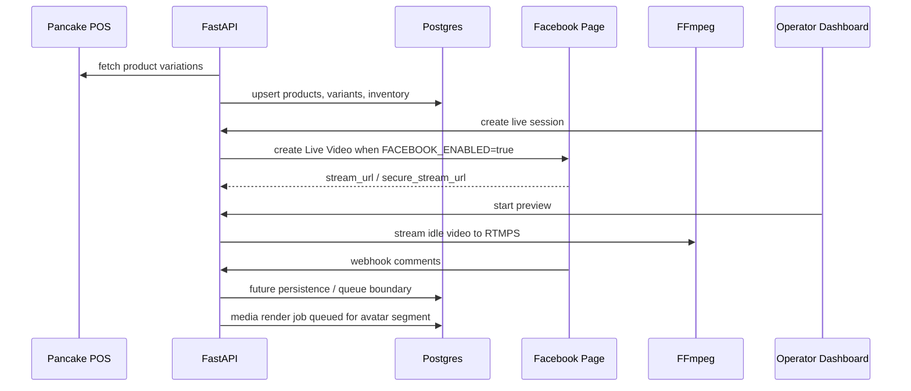

# AI Livestream Architecture

## Boundary

`dtp-ai-stream` currently owns livestream orchestration and Pancake catalog
sync. It does not own checkout, payment, fulfillment, or order state yet.

Avatar rendering, TTS, upper-body gesture motion, and lip-sync video are
represented by quality profiles and media render jobs. The basic stream path
uses FFmpeg and does not require GPU; GPU is required only when a render job is
submitted to Modal/local GPU.

## Current Modules

```text
api/
  facebook.py       webhook verification, webhook ingest, local dev comments
  live.py           live session control used by the dashboard
  live_sessions.py  aliases for live session routes
  products.py       Pancake shop connect, product preview/sync, catalog read
  ops.py            lightweight live operations counters
  media.py          AI/TTS/avatar/render profile and render job API

services/
  meta/             Facebook Graph/webhook adapter boundary
  pancake/          Pancake POS product sync into Postgres
  stream/           FFmpeg RTMPS broadcaster
  comments/         normalization and rule parser scaffold
  media/            optional speech queue scaffold
                    render profile and GPU inference handoff
```

The default avatar profile targets an upper-body livestream host: EchoMimicV2
for lip-sync, hand gesture, and body motion; MuseTalk is only a fallback
lip-sync engine for cheaper tests.

## Sequence



## Current Database Scope

```text
tenants
pancake_shops
products
product_variants
inventory
facebook_pages
live_sessions
live_session_products
live_comments
ai_response_jobs
speech_queue_items
ai_model_profiles
avatar_models
render_profiles
media_render_jobs
```

## Deferred

- OAuth page connection UI.
- Facebook comment reply API.
- Real token encryption.
- Persistent repository layer for all live/comment/job routes.
- Actual Modal/local GPU inference endpoint for render jobs.
- Order/cart/payment tables.
